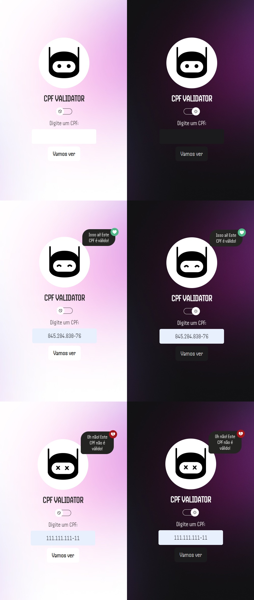

<table align="left">
    <tr>
        <td>
            <b>
              <a href="README.md"> 🇧🇷 Português </a>
            </b>
        </td>
        <td>
            <a href="readme-us.md"> 🇺🇸 English </a>
        </td>
    </tr>

</table>


<p align="right">
  <a href="#-tecnologias">Tecnologias</a>&nbsp;&nbsp;&nbsp;|&nbsp;&nbsp;&nbsp;
  <a href="#-projeto">Projeto</a>&nbsp;&nbsp;&nbsp;|&nbsp;&nbsp;&nbsp;
  <a href="#-layout">Layout</a>&nbsp;&nbsp;&nbsp;|&nbsp;&nbsp;&nbsp;
  <a href="#-licença">Licença</a>
</p>

<br> <br>

# Validador de CPF 


 


<br>

## 🚀 Projeto

O projeto consiste na criação de uma aplicação React que interage com com o usuário para validação de CPF.

<br>
A lógica para a validação de CPF utilizada no projeto foi com base em que um número de CPF é composto por 11 dígitos, os 9 primeiros são os números base, e os 2 últimos são os chamados dígitos verificadores, que são utilizados para validar se os 9 números base estão corretos.

- A primeira validação feita foi  multiplicar cada número base em separado, começando com 10 e terminando com 2 e reservando a soma do total de cada multiplicação em um acumulador; 

- Depois, reservado o resto da divisão do resultado dessa soma por 11;

- Se o resto da divisão for maior do que 9, o primeiro dígito será 0, se não for, o dígito será o próprio resto da divisão.

- O segundo dígito a ser validado será a diferença entre o número 11 e o primeiro dígito;

- Por fim é feito uma validação entre o número final com os últimos dígitos e o número digitado e é impresso em tela um retorno para o usuário.

<br>

### ⚙ Funcionalidades 
- Validação de CPF;
- Light e dark mode.

### 🛠 Execute a Aplicação
Para executar a aplicação na sua máquina local, siga estes passos:
<br>
1. Clone o repositório usando o comando: 

```bash
git clone https://github.com/iMetzker/cpfvalidator.git
```
2. Abra o projeto em seu ambiente de desenvolvimento.

3. Certifique-se de de que o yarn esteja instalado. Caso contrário abra o terminal do seu ambiente de desenvolvimento e execute o comando:

```bash
npm install -g yarn
```
4. Inicie o servidor para vizualizar o projeto usando o comando:

```bash
yarn run start
```
<br>

## 🛸 Tecnologias

Esse projeto foi desenvolvido com as seguintes tecnologias:

- HTML e CSS;
- Javascript;
- React;
- Styled Components;
- Git.

## 💻 Layout



<br>

<p align="center">🔎 Visite o site em execução <a href="https://cpfvalidator-imetzker.netlify.app/">aqui.</a>
</p>

## ✔ Licença
Este projeto é licenciado sob os termos da Licença MIT — Consulte o arquivo <a href="/LICENSE">LICENSE</a> para obter detalhes.

<p align="center">
  <a href="/LICENSE">
    
  </a>
</p>


